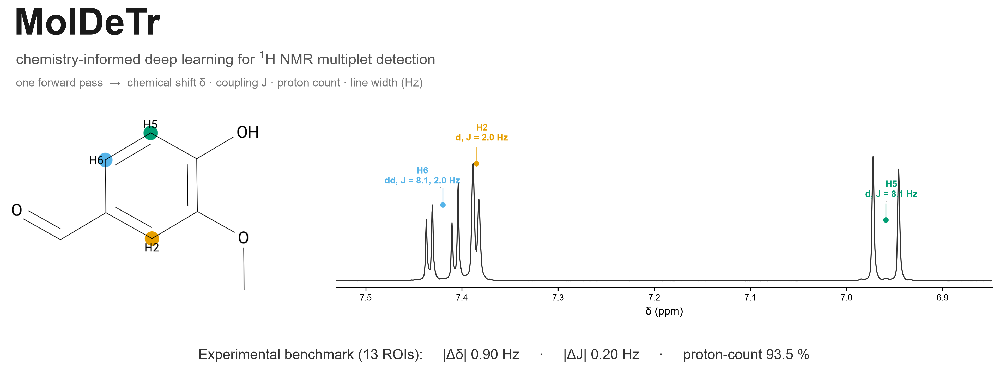
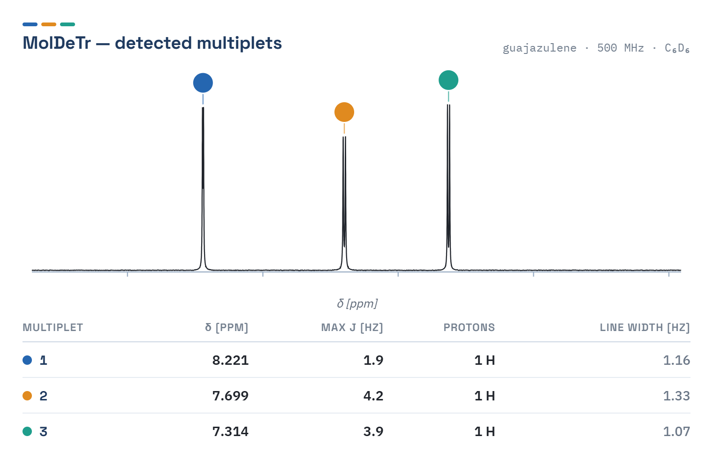
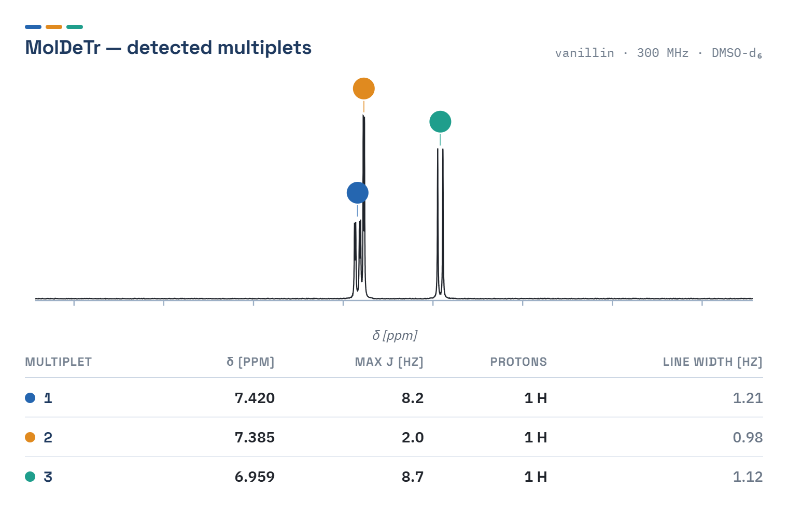
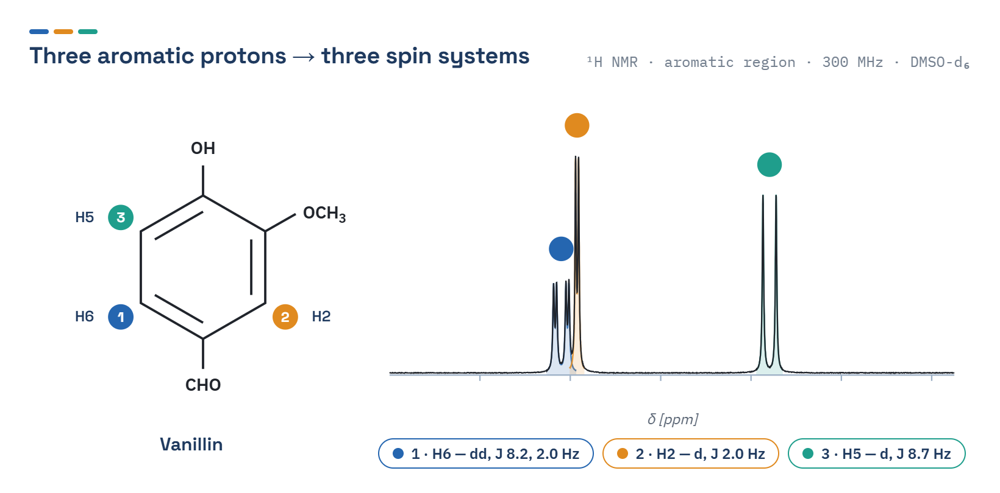
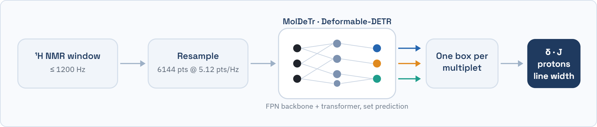
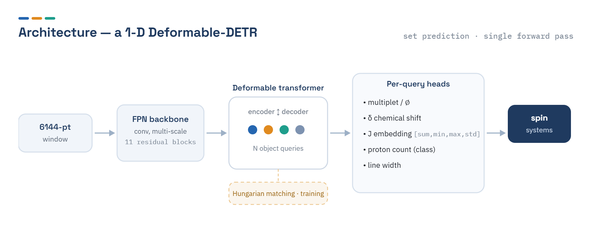
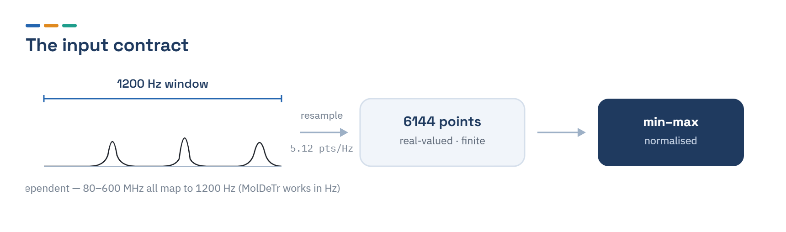
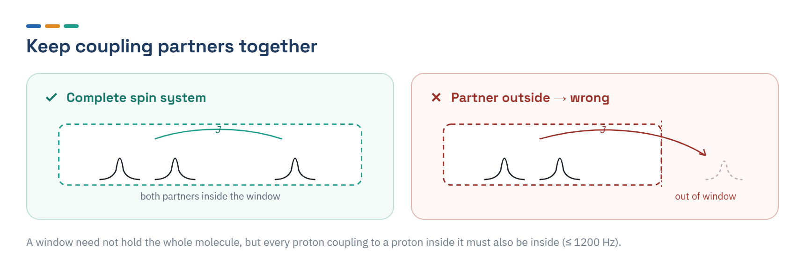
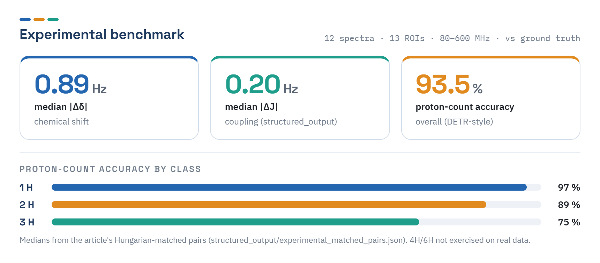

<p align="center">
  <picture>
    <source media="(prefers-color-scheme: dark)" srcset="docs/banner-dark.png">
    
  </picture>
</p>

<p align="center">
  <a href="https://zenodo.org/badge/latestdoi/1289888357"></a>
  <a href="https://doi.org/10.1021/acs.analchem.5c03465"></a>
  <a href="LICENSE"></a>
  <a href="pyproject.toml"></a>
  <a href="https://github.com/smidooo/MolDeTr/actions/workflows/ci.yml"></a>
  <a href="https://github.com/smidooo/MolDeTr/commits"></a>
  <a href="https://github.com/smidooo/MolDeTr/stargazers"></a>
</p>

<p align="center">
  <a href="https://colab.research.google.com/github/smidooo/MolDeTr/blob/main/notebooks/MolDeTr_colab_demo.ipynb"></a>
  <a href="https://colab.research.google.com/github/smidooo/MolDeTr/blob/main/notebooks/MolDeTr_quickstart.ipynb"></a>
  <a href="https://doi.org/10.1021/acs.analchem.5c03465"></a>
</p>

<p align="center">
  <b>A chemistry-informed deep learning model for automated analysis of ¹H NMR spectra.</b><br>
  One forward pass per spectrum window: chemical shift δ, coupling J, proton count, line width —<br>
  no prior structure, no reference standards, no iterative fitting.
</p>

---

## The 30-second tour

<p align="center">
  <picture>
    
  </picture>
</p>
<p align="center"><b>Guajazulene, 500 MHz</b> — a clean high-field case: three aromatic protons, resolved in one forward pass.</p>

Reading a ¹H NMR spectrum by hand means picking peaks, grouping them into multiplets, counting protons,
and measuring coupling constants. It is slow and hard to reproduce, and least reliable on the hardest
cases: overlapping signals and strong (higher-order) coupling. MolDeTr produces all four in a single
forward pass.

MolDeTr reads a 1D ¹H NMR spectrum and returns the spin systems in it directly: for each group of
equivalent protons it gives the chemical shift (δ), the coupling (J), the proton count, and the line
width. If you know NMR but not machine learning: it replaces manual peak-picking and multiplet analysis
for a region. If you know ML but not NMR: it is a 1D object detector (a DETR) that predicts a labelled box
per multiplet instead of asking a chemist to annotate one by hand.

It was trained on quantum-mechanical spin-dynamics simulations with realistic experimental distortions,
and it works on real spectra from 80 to 600 MHz. This repository holds the model code, the training and
evaluation entry points, the Hydra configuration, and the ground-truth ROI annotations. The trained
**weights** and the **spectral data** live on Zenodo (see [Install](#install)).

> **Research code accompanying the paper.** MolDeTr extracts δ, proton count, and couplings from real
> ¹H NMR spectra — including the congested, strongly-coupled cases it was built for. It is largely
> field-agnostic — it works in Hz, so it was tested across 80–600 MHz (and simulated down to ~5 MHz).
> Predictions can deviate for inputs outside its trained regime: unusual distortions, non-standard pulse
> sequences or processing, mixtures/impurities, or regions wider than the 1200 Hz window. `max J` is the
> dominant coupling per multiplet (the full set is in the committed `structured_output` path). Read
> **[Scope &amp; limitations](docs/SCOPE.md)** and **[Usage notes](docs/USAGE_NOTES.md)**, and
> sanity-check predictions against your own chemistry.

> **Questions?** Email [nicolas.schmid.research@gmail.com](mailto:nicolas.schmid.research@gmail.com) or open an
> [issue](https://github.com/smidooo/MolDeTr/issues/new/choose). If MolDeTr helps your work, please ⭐ the repo and [cite the paper](#how-to-cite).

## Choose your path

| You are… | Start here |
|---|---|
| **Bench chemist / spectroscopist** | [Try it in 2 minutes](#try-it-in-2-minutes) · [Test it on YOUR data](#test-it-on-your-data) · [FAQ](#faq) |
| **ML researcher** | [How it works](#how-it-works) · [Train and evaluate](#train-and-evaluate) · [Reproducing the paper](#reproducing-the-paper) |
| **Method developer** | [Scope &amp; limitations](docs/SCOPE.md) · [Input format](docs/INPUT_FORMAT.md) · [Usage notes](docs/USAGE_NOTES.md) |
| **New to NMR or ML** | [Glossary](#glossary-nmr--ml) · [How it works](#how-it-works) · [FAQ](#faq) |

## What it does — and what it does not

| **Does** | **Does not** |
|---|---|
| Detects the multiplets in one spectral window and reports δ, proton count, line width, and the largest coupling (`max J`) per multiplet — see [Scope](docs/SCOPE.md) for how much to trust each output. | Read raw vendor files, phase/baseline-correct, or choose regions — you supply one preprocessed window (see [Test it on YOUR data](#test-it-on-your-data)). |
| Handles overlap and strong coupling that defeat rule-based peak-picking. | Identify the molecule or assign peaks to atoms — it returns spin-system parameters, not a structure. |
| Generalises across field strengths (80–600 MHz) because it works in Hz, not ppm. | Handle a multiplet whose coupling partner sits outside the analysed window (see the rule in [Test it on YOUR data](#test-it-on-your-data)). |

## A harder case: the vanillin ABX

<p align="center">
  <picture>
    <source media="(prefers-color-scheme: dark)" srcset="docs/img/example_prediction_vanillin-dark.png">
    
  </picture>
</p>
<p align="center"><b>Vanillin, 300 MHz</b> — the classic 1,2,4-trisubstituted-benzene ABX: two ortho doublets
(J ≈ 8 Hz) and a meta doublet (J ≈ 2 Hz). The live predictions reproduce the ground truth — proton counts, δ,
and <code>max J</code> 8.2 / 2.0 / 8.7 vs 8.1 / 2.0 / 8.1 Hz.</p>

<p align="center">
  <picture>
    <source media="(prefers-color-scheme: dark)" srcset="docs/img/vanillin_spin_systems-dark.png">
    
  </picture>
</p>
<p align="center"><b>The same three protons, on the molecule.</b> Each aromatic proton is its own spin system:
H5 is a clean ortho doublet (J ≈ 8 Hz to H6), H2 a meta doublet (J ≈ 2 Hz to H6), and H6 the
doublet-of-doublets that couples to both. The colours link every ring position to its multiplet above — the
spin-system structure MolDeTr recovers without ever seeing the molecule.</p>

## Try it in 2 minutes

The one command that needs nothing but the repo reproduces the paper's headline numbers from committed data:

```bash
git clone https://github.com/smidooo/MolDeTr.git && cd MolDeTr
pip install -e ".[dev]"                       # CPU-only PyTorch is fine
python scripts/aggregate_experimental.py      # → |Δδ| 0.90 Hz · |ΔJ| 0.20 Hz · proton-count 93.5 %
```

To run the model itself, download the checkpoint from Zenodo (see [Install](#install)), then:

```bash
python scripts/predict.py --demo                                  # synthetic smoke run
python scripts/predict.py --input examples/roi_S8_example.npz --plot   # a bundled real ROI, writes a PNG
python app.py                                                     # the point-and-click GUI (pip install -e ".[app]")
```

Prefer no install at all? Run it in Colab — the [▶ interactive app](https://colab.research.google.com/github/smidooo/MolDeTr/blob/main/notebooks/MolDeTr_colab_demo.ipynb)
(Detect + Simulate, launched with a public share link) or the [▶ quickstart notebook](https://colab.research.google.com/github/smidooo/MolDeTr/blob/main/notebooks/MolDeTr_quickstart.ipynb) (predict on a bundled example).

## How it works

<p align="center">
  <picture>
    <source media="(prefers-color-scheme: dark)" srcset="docs/img/pipeline-dark.png">
    
  </picture>
</p>

*Pipeline, in words (for screen readers):* a ¹H NMR window of up to 1200 Hz is
resampled to 6144 points at 5.12 points/Hz, passed through a Deformable-DETR (a convolutional FPN backbone
feeding a deformable-attention transformer), which emits one box per multiplet; each box is decoded to a
chemical shift δ, a coupling J, a proton count, and a line width.

A convolutional FPN backbone turns the 6144-point window into multi-scale features. A deformable-attention
transformer with a fixed set of object queries then predicts, for each query, whether it found a multiplet
and — if so — its position and parameters. Training matches predictions to ground truth with the Hungarian
algorithm, so the model learns set prediction directly and needs no hand-tuned peak-picking. Detection at
inference is a single pass; the parameters come straight from the matched queries. The op that makes the
attention practical on long 1D signals has a compiled CUDA kernel and a pure-PyTorch fallback, so inference
runs on CPU with no build step. Terms in **bold** above are defined in the [glossary](#glossary-nmr--ml).

The network in full — an FPN backbone, a deformable-attention transformer with a fixed set of object
queries, and per-query heads matched to ground truth by the Hungarian algorithm at training time:

<p align="center">
  <picture>
    <source media="(prefers-color-scheme: dark)" srcset="docs/img/architecture-dark.png">
    
  </picture>
</p>

## Test it on YOUR data

There are three ways in, from zero-effort to full control:

**1. No install — the GUI in Colab.** The [▶ interactive Colab app](https://colab.research.google.com/github/smidooo/MolDeTr/blob/main/notebooks/MolDeTr_colab_demo.ipynb)
launches the same point-and-click GUI — drop a `.npz`/`.npy` window in; it shows the assignment table +
annotated plot and validates the input for you — or run it locally with `python app.py`.

**2. One line — `predict.py`.** With the checkpoint in place:
```bash
python scripts/predict.py --input your_window.npz --plot
# → per multiplet: proton count · δ (ppm/Hz) · max J (Hz) · line width · confidence, and an annotated PNG
```

**3. Prepare a window from raw data.** MolDeTr expects **6144 points at 5.12 points/Hz** (a **1200 Hz**
window), real-valued; only the overall scale is normalised away (relative intensities still matter).
[`docs/INPUT_FORMAT.md`](docs/INPUT_FORMAT.md) gives the full contract, a preparation recipe, and a **Bruker
TopSpin** phasing/baseline recipe; `moldetr/validation.py` enforces the contract and tells you exactly what
to fix. The [Colab notebook](https://colab.research.google.com/github/smidooo/MolDeTr/blob/main/notebooks/MolDeTr_quickstart.ipynb)
is a ready template.

<p align="center">
  <picture>
    <source media="(prefers-color-scheme: dark)" srcset="docs/img/input_contract-dark.png">
    
  </picture>
</p>

> **One rule worth repeating.** A window need not contain the whole molecule, but every proton that couples
> to a proton *inside* the window must also be inside it. A multiplet whose coupling partner is outside the
> region is out of distribution, and its prediction will be wrong. Draw regions so each spin system is complete.

<p align="center">
  <picture>
    <source media="(prefers-color-scheme: dark)" srcset="docs/img/coupling_rule-dark.png">
    
  </picture>
</p>

## Install

### 1. Clone and create the environment
```bash
git clone https://github.com/smidooo/MolDeTr.git
cd MolDeTr
conda env create -f environment.yml
conda activate moldetr
```
Prefer pip? `pip install -e ".[app]"` (add `dev` for the tests, `eval` for `evaluate_synthetic.py`).
For **bit-exact** reproduction of the training environment (CUDA 11.7, linux-64), use the explicit lockfile:
`conda create --name moldetr --file requirements-lock-linux64.txt`.

**CPU-only:** remove the `pytorch-cuda` line from `environment.yml` first (or install CPU PyTorch with pip).
Inference then uses the pure-PyTorch fallback of the deformable-attention op — no CUDA, no compilation.

**Supported versions:** Python 3.10–3.12 (newer versions may lack compatible PyTorch wheels). The
`fastai>=2.7,<2.8` pin — required so `learner.load()` works — caps PyTorch at 2.6; this is a downgrade
from the latest release but is benign for CPU inference.

### 2. (GPU only) Build the deformable-attention op
```bash
cd moldetr/model/ops
bash make.sh            # or: python setup.py build install
cd ../../..
```
Optional for CPU inference — the model falls back to `ms_deform_attn_core_pytorch` when the extension is absent.

### 3. Smoke test
```bash
python scripts/quick_validation.py     # confirms imports + ROI metadata load; no weights or data needed
```

### 4. Get the weights and data (Zenodo)
The trained weights and the spectral regions are archived on Zenodo
(**DOI [10.5281/zenodo.21217102](https://doi.org/10.5281/zenodo.21217102)**), not in git. Download the
checkpoint `model_spin_system_ABCDEFG_exp2.pth` into `moldetr/model/` — where `conf/config_big.yaml`
expects it (`paths.model_folder_save`, `lognames.best_model_file`).

## Train and evaluate

Configuration is [Hydra](https://hydra.cc); `conf/config_big.yaml` is the production config, and any field
can be overridden on the command line:

```bash
python scripts/train.py                        # train (CUDA required)
python scripts/train.py optim_params.batch_size=8   # example override

python scripts/evaluate_experimental.py        # the 13 experimental ROIs (S1..S13); needs checkpoint + ROI npz
pip install -e ".[eval]"                       # evaluate_synthetic needs pandas/seaborn/scikit-learn/cmcrameri
python scripts/evaluate_synthetic.py           # synthetic test set; needs checkpoint + synthetic npz
python scripts/evaluate_synthetic.py device.device_name=cpu   # force CPU on a box without CUDA
```

### Predict on a single spectrum
```bash
python scripts/predict.py --demo                                     # synthetic smoke run (checkpoint only)
python scripts/predict.py --input examples/roi_S8_example.npz --plot   # a real ROI; ppm read from the .npz
```
Add `--input your_window.npz` for your own data. The `--plot` flag writes the annotated figure shown above.

### Graphical interface
A [Gradio](https://gradio.app) app: load a spectrum, get the assignment table and the annotated plot.


```bash
pip install -e ".[app]"
python app.py
```
Runs locally, and can be deployed unchanged as a Hugging Face Space (set the checkpoint via `MOLDETR_CHECKPOINT`).
Ready-to-try inputs are in [`examples/`](examples/).

<details><summary>Static screenshot (full detail)</summary>


</details>

## Reproducing the paper

<p align="center">
  <picture>
    <source media="(prefers-color-scheme: dark)" srcset="docs/img/benchmark-dark.png">
    
  </picture>
</p>

The article's headline experimental medians are **0.89 Hz** (|Δδ|), **0.20 Hz** (|ΔJ|), and **93.5 %**
proton-count accuracy. The evaluation set is **13 ROIs across 12 spectra** (the ethyl vanillin spectrum
contributes two regions, S5 and S5_R2), spanning 10 compounds at 80–600 MHz.

| Command | What it does | Needs |
|---|---|---|
| `python scripts/aggregate_experimental.py` | recompute the medians + per-class accuracy from committed match data | nothing (CPU, in-repo) |
| `python scripts/evaluate_experimental.py`  | regenerate predictions from the weights | checkpoint + ROI npz (Zenodo) |
| `python scripts/evaluate_synthetic.py`     | synthetic test-set metrics | checkpoint + synthetic npz (Zenodo), `.[eval]` |

`aggregate_experimental.py` reads the article's Hungarian-matched pairs
(`structured_output/experimental_matched_pairs.json`) and reproduces all three headline numbers exactly:
median |Δδ| = 0.90 Hz, median |ΔJ| = 0.20 Hz, and overall proton-count accuracy = 93.5 % (matched-only
92.1 %). "Overall" is the DETR-style figure — matched-correct plus correctly-empty queries, over all
queries. Two decode paths exist, and this matters for J. The committed path (`structured_output` +
`aggregate_experimental.py`) inverts the article's exact coupling post-processing — these are the
paper's numbers. The live tools (`predict.py`, the GUI, `evaluate_experimental.py`) instead report a
single **largest coupling, max(J)**, per multiplet (the coupling head emits a permutation-invariant
embedding `[sum, min, max, std]`, and the demo surfaces only its max component). The live path
**reproduces the paper's proton counts, shifts, and largest coupling `max J`**; the committed path
additionally recovers the *full* coupling set per multiplet (the exact E⁻¹) — that is the only
difference. Predictions can deviate for inputs outside the trained regime. (The live tools also inject the same calibrated input noise the
model was trained and evaluated with; see [Scope](docs/SCOPE.md).)

> **Synthetic numbers.** The synthetic set on Zenodo is a small representative subset of the full test set
> used in the paper, so `evaluate_synthetic.py` will land close to, but not exactly on, the published
> synthetic figures. The experimental numbers above reproduce exactly.

## Platform and hardware
- **CPU (any OS):** works out of the box — the deformable-attention op falls back to pure PyTorch, so no
  CUDA build is needed for inference, the tests, or `predict.py`.
- **NVIDIA GPU:** optional; build the CUDA op (`moldetr/model/ops/`) for faster training and inference.
- **Apple Silicon:** CPU or MPS — install without `pytorch-cuda`; `device.device_name=cuda` falls back to
  `mps` then `cpu`.
- **Windows:** supported for inference and the test suite; the Linux `file_system` sharing strategy is
  skipped automatically.
- CI runs `ruff` + `quick_validation` + `pytest` + the headline reproduction on **ubuntu, macOS, and
  windows** (Python 3.10 and 3.11).

## Glossary (NMR ↔ ML)

New to one side of this? These are the terms that matter.

| NMR | Meaning |
|---|---|
| chemical shift **δ** | peak position, in ppm (field-independent) or Hz |
| coupling constant **J** | spacing between sub-peaks of a multiplet, in Hz |
| **multiplet** | a peak split into sub-peaks by coupling (singlet, doublet, triplet, …) |
| proton count | number of equivalent protons giving rise to the multiplet |
| **spin system** | a set of mutually coupled protons |
| **ROI** | region of interest — one analysed window of the spectrum |

| ML | Meaning |
|---|---|
| object detection / **box** | here, a 1D interval on the ppm axis marking one multiplet |
| **DETR** | detection transformer — predicts a *set* of objects, no hand-tuned peak-picking |
| deformable attention | attention that samples a few relevant points, so it scales to long signals |
| object **query** | a learned slot that becomes one predicted multiplet (or "nothing") |
| Hungarian matching | optimal prediction-to-ground-truth assignment, used in training |
| checkpoint | the trained weights (on Zenodo) |

## FAQ

**"Spectrum has N points, but MolDeTr needs exactly 6144."** Your window is the wrong size. Resample it to
5.12 points/Hz over a 1200 Hz region and pad/crop to 6144 points — see
[`docs/INPUT_FORMAT.md`](docs/INPUT_FORMAT.md).

**"Checkpoint not found."** Download `model_spin_system_ABCDEFG_exp2.pth` from
[Zenodo](https://doi.org/10.5281/zenodo.21217102) into `moldetr/model/`, or point to it with `--checkpoint`.

**Do I need a GPU?** No. Inference, the tests, and `predict.py` run on CPU via the pure-PyTorch fallback.
A GPU only speeds up training and large batches.

**Why 0.89 in the paper but 0.90 here?** Rounding of the same median; `aggregate_experimental.py` prints
0.90. Both refer to the identical matched pairs.

**A multiplet came out wrong at the edge of my window.** Its coupling partner is probably outside the
window. Widen or re-centre the region so the whole spin system is inside it (≤ 1200 Hz).

**How many multiplets can it find at once?** Up to **10 equivalent-spin groups** per 1200 Hz window —
an engineering limit, not a physical one. Split a busier region into several windows.

**Can it do ¹³C, 2D, or mixtures?** No — 1-D ¹H only, one clean compound per spectrum. Water/solvent
suppression, mixtures, and non-¹³C heteronuclear artifacts are out of scope; see
[`docs/SCOPE.md`](docs/SCOPE.md). The 4H and 6H proton classes exist in training but were not tested
on real spectra.

**How accurate is the coupling (J)?** The live `predict.py`/GUI reproduce the
paper's largest coupling `max J` closely (e.g. vanillin `max J` 8.2/2.0/8.7 vs 8.1/2.0/8.1 Hz). `max J`
is only the *largest* coupling per multiplet; the committed `structured_output` path recovers the full set
(the paper's per-coupling 0.20 Hz median). Predictions can deviate for inputs outside the trained regime —
see [Scope → coupling constants](docs/SCOPE.md#about-the-coupling-constants).

## How to cite
Cite the **article** as the primary reference:

```bibtex
@article{Schmid2026MolDeTr,
  author  = {Schmid, Nicolas and Wanner, Marc and Fischetti, Giulia and Henrici, Andreas and
             Meshkian, Mohsen and Bruderer, Simon and Füchslin, Rudolf M. and Heitmann, Bjoern and
             Wegner, Jan Dirk and Sigel, Roland K. O. and Wilhelm, Dirk},
  title   = {{MolDeTr}: A Chemistry-Informed Deep Learning Model for Next-Generation
             Automated Analysis of $^{1}$H NMR Spectra},
  journal = {Analytical Chemistry},
  year    = {2026},
  doi     = {10.1021/acs.analchem.5c03465}
}
```

For the **software**, use the Zenodo concept DOI `10.5281/zenodo.21214876` (it resolves to the latest
release). For the **data**, use the Zenodo concept DOI `10.5281/zenodo.21217101` (it resolves to the latest
dataset version). Machine-readable metadata is in [`CITATION.cff`](CITATION.cff) — GitHub's "Cite this repository"
button uses it.

## Availability
**Code.** Apache-2.0, at <https://github.com/smidooo/MolDeTr>, archived at Zenodo
(DOI [10.5281/zenodo.21214876](https://doi.org/10.5281/zenodo.21214876)). The trained weights are deposited
with the data (concept DOI [10.5281/zenodo.21217101](https://doi.org/10.5281/zenodo.21217101), all versions).

**Data.** A selection of the simulated and experimental spectral regions analysed in this work, with their
ground-truth spin-system annotations and metadata, is at Zenodo
(concept DOI [10.5281/zenodo.21217101](https://doi.org/10.5281/zenodo.21217101), all versions). The metadata follow the format
used in the Supporting Information; full curation details are in Supporting Information Section 4.4.

## License
Apache License 2.0; see [`LICENSE`](LICENSE). © 2026 Nicolas Schmid and the MolDeTr authors.

## Contact
Corresponding authors: Nicolas Schmid (<nicolas.schmid.research@gmail.com>, ORCID
[0000-0003-1930-7654](https://orcid.org/0000-0003-1930-7654)); Dirk Wilhelm (<wilk@zhaw.ch>, ORCID
[0000-0001-5109-9803](https://orcid.org/0000-0001-5109-9803)). For questions or "my spectrum didn't work"
reports, an [issue](https://github.com/smidooo/MolDeTr/issues/new/choose) is often fastest.

## Acknowledgements
Supported by Innosuisse — Swiss Innovation Agency (Grant No. 2155007318).

## Star history

<p align="center">
  <a href="https://star-history.com/#smidooo/MolDeTr&Date"></a>
</p>
